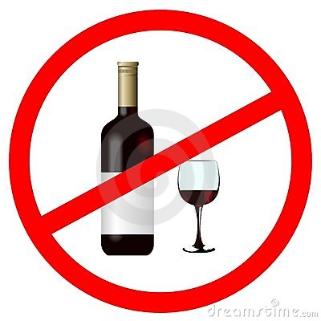
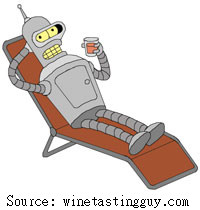

WineQuality Assessment Application
========================================================
author: laborant
date: 2015-05-24
transition: rotate

No more expensive focus groups!
========================================================



***

Dear winemakers and wine researchers!  

Now you can assess wine quality right after chemical analysis!


WineQuality Application
========================================================
left: 30%



***

With this new online based application,  
you just need to put the sliders to the right positions, and...  
here is your predicted wine quality!

Let's go through the example  
(see code on the next slide):  
1. We make a vector of some parameters' values and load the model.  
2. Then we can compute the prediction.

Example
========================================================


```r
params <- data.frame(fixed.acidity=6.704, volatile.acidity=0.515, citric.acid=0.3154, residual.sugar=3.208, chlorides=0.01602, free.sulfur.dioxide=67.24, total.sulfur.dioxide=119.708, density=0.99, pH=3.58946, sulphates=0.70416, alcohol=12.8576, color="red")
```


```r
load(rawConnection(url.model))
```
And wine quality is (score between 1 and 9)...

```r
round(predict(modelFit,newdata=params),5)
```

```
[1] 7.28183
```

Moreover!
========================================================

With WineQuality app, you can play around with the parameters and understand how changing each of them impacts on the wine quality!

# Visit us on

## <u><a href="http://laborant.shinyapps.io/winequality">laborant.shinyapps.io/winequality/</a></u>
<br/>

 
## ~~Happy winemaking!~~
